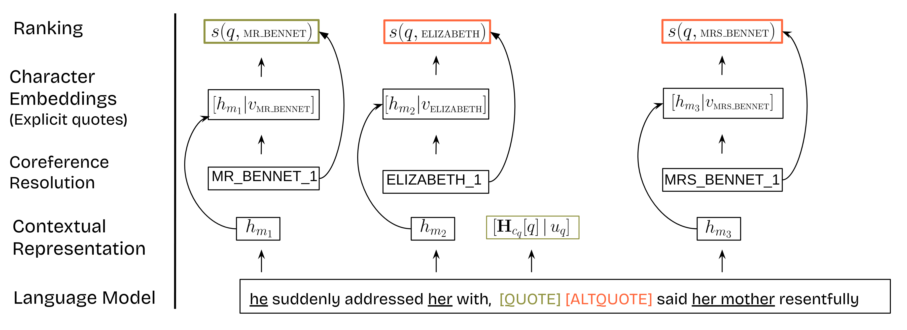

# Improving Quotation Attribution with Literary Character Embeddings


## Introduction

Note that this repository uses the Huggingface implementation of [UAR Scene](https://huggingface.co/gasmichel/UAR_scene) and [UAR Play](https://huggingface.co/gasmichel/UAR_Play). 

## Training 

To train a model on PDNC, you can run the following command:

```
python train_speaker.py --dataPath=data/pdnc-no-minor_w100_full --sourceData=../data/pdnc_source/ --base_model=SpanBERT/spanbert-large-cased --savePath=results_vanilla_span_w100_full --model_mode=vanilla
```

and if using our UAR embeddings, use:
```
python train_speaker.py --dataPath=data/pdnc-no-minor_w100_full --sourceData=../data/pdnc_source/ --base_model=SpanBERT/spanbert-large-cased --savePath=results2_scene_drama_span_w100_full --model_mode=uar_scene
```

the `model_mode` argument accepts: [`vanilla`, `semantics`, `luar`, `uar_scene`, `uar_play`].

### Inference

To run inference on the 6 novels that are part of the second release of PDNC, run:

```
python test_speaker.py --dataPath=data/test-pdnc-no-minor-w100_full --sourceData=../data/test_pdnc_source/ --base_model=SpanBERT/spanbert-large-cased --savePath=test_results_vanilla_span_w100_full --model_mode=vanilla --model_path=results_vanilla_span_w100_full/split_0/best_model.model
```
